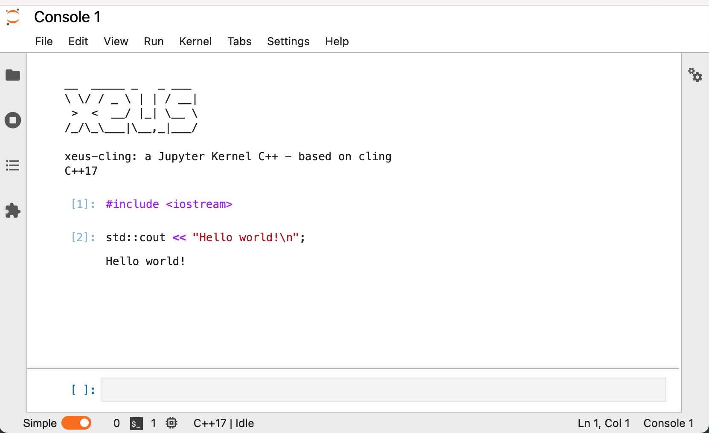

# Interpreter / Cling

If you are using C++ for scientific computing or learning C++, it's often useful to have a C++ interpreter for short experiments.

You can install Cling from most package managers for [Linux](https://pkgs.org/download/cling) or [Mac OS](https://formulae.brew.sh/formula/cling). You can also follow the [instructions](https://root.cern/cling/cling_build_instructions/) on their website to download the binaries or build it from source.

Although you can use `cling` directly, it is much more convenient to use the interpreter as a Jupyter notebook kernel. You can follow [these instructions](https://jupyter.org/install.html) to install Jupyter Lab, and [these instructions](https://xeus-cling.readthedocs.io/en/latest/installation.html) to install the `xeus-cling` kernel. 

This creates a beautiful environment for playing with C++ interactively:

